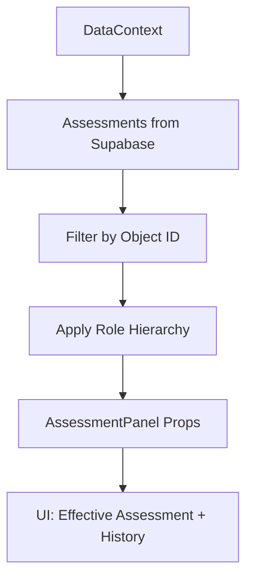

## Überblick: Was Assessments leisten

Assessments bewerten Personen, Organisationen, Schiffe und Vorfälle mit einer Gefahrenstufe, einer Klassifikation und einem Status. Sie bilden die zentrale Grundlage für operative Entscheidungen in Sentinel.

Ein Assessment kann direkt in einem eigenen Bereich verwaltet oder in Detailansichten (z.B. eines Vorfalls) eingebettet angezeigt werden. Höher privilegierte Rollen wie High Judge und Sentinel dürfen Bewertungen niedrigerer Rollen übersteuern.

<Callout kind="info">

Assessments sind immer **objektbezogen**: Jede Person, Organisation, jedes Schiff oder jeder Vorfall kann mehrere Bewertungen mit unterschiedlichen Rollenherkünften haben. Die aktuell wirksame Bewertung ergibt sich aus der hierarchischen Logik.

</Callout>

## Rollenmodell und Bewertungshoheit

Die Rollen aus dem Anwenderhandbuch bestimmen, wer welche Assessments anlegen oder übersteuern darf:

- Citizen
- Bounty Hunter
- Judge
- High Judge
- Sentinel
- Admin

### Bewertungsrechte nach Rolle

<Tabs>
  <Tab title="Judge" icon="gavel">

Ein **Judge** erstellt und aktualisiert operative Assessments, z.B. für laufende Vorfälle oder bekannte Verdächtige. Diese Bewertungen gelten, solange keine höherwertige Rolle (High Judge oder Sentinel) für dasselbe Objekt eine abweichende Bewertung setzt.

Typische Aufgaben als Judge:

- Neue Gefahrenstufe für einen Vorfall setzen
- Klassifikation anpassen, wenn neue Informationen eintreffen
- Status des Assessments pflegen (z.B. aktiv, geprüft, verworfen)

  </Tab>
  <Tab title="High Judge" icon="shield">

Ein **High Judge** überprüft und übersteuert bei Bedarf Assessments von Judges, insbesondere bei widersprüchlichen Einschätzungen oder Fällen mit hoher Tragweite. High-Judge-Entscheidungen haben Vorrang vor Judge-Bewertungen.

Typische Aufgaben als High Judge:

- Konfliktfälle zwischen mehreren Judge-Assessments entscheiden
- Gefahrenstufen eskalieren oder deeskalieren
- Endgültige Klassifikation für sensible Objekte setzen

  </Tab>
  <Tab title="Sentinel" icon="zap">

Die Rolle **Sentinel** repräsentiert die höchste Bewertungsebene im System. Sentinel-Assessments setzen den global wirksamen Maßstab, insbesondere für Systemalarme und automatisierte Maßnahmen.

Typische Aufgaben als Sentinel:

- Systemweit gültige Gefahrenstufen definieren
- Inkonsistenzen über viele Fälle hinweg erkennen und korrigieren
- Grenzfälle der High-Judge-Bewertungen final entscheiden

  </Tab>
</Tabs>

<Callout kind="tip">

Citizen und Bounty Hunter liefern in der Regel Hinweise und Meldungen, die **Eingangsdaten** für Assessments darstellen, aber selbst keine wirksame Bewertungshierarchie aufbauen. Admins konfigurieren Rollen und Berechtigungen, greifen aber fachlich nicht in Bewertungsinhalte ein.

</Callout>

## Hierarchische Übersteuerungslogik

Die hierarchische Logik bestimmt, welche Bewertung für ein Objekt als aktuell wirksam gilt, wenn mehrere Rollen unterschiedliche Assessments abgegeben haben.

- Judge-Assessments gelten als Basisbewertung.
- High-Judge-Assessments **übersteuern** Judge-Assessments für dasselbe Objekt.
- Sentinel-Assessments **übersteuern** sowohl Judge- als auch High-Judge-Assessments.
- Innerhalb derselben Rolle setzt z.B. die **neueste** Bewertung die ältere außer Kraft (konkrete Logik siehe Implementierung).

<Callout kind="info">

Die Anwendung zeigt in der Regel die **wirksame Bewertung** hervorgehoben an und bietet Zugriff auf die Historie der übrigen Assessments. Rollen mit Übersteuerungsrecht sehen zusätzlich, **welche Bewertung sie überstimmen**.

</Callout>

<Callout kind="danger">

Wenn eine höhere Rolle ein Assessment übersteuert, verliert die niedrigere Rollenbewertung **nicht** ihre Historie. Sie bleibt nachvollziehbar, ist aber **nicht mehr maßgeblich** für Alarme, Workflows oder Entscheidungen.

</Callout>

## Benutzeroberfläche: Wo Assessments auftauchen

Assessments erscheinen in Sentinel an zwei wichtigen Stellen:

- **Eigenständige Seite:** `Assessments` als separater Navigationspunkt, implementiert in `src/pages/AssessmentsPage.jsx`.
- **Eingebettetes Panel:** `AssessmentPanel` als Teil von Detailansichten, z.B. in Vorfällen, Personen- oder Organisationsdetails, implementiert in `src/components/AssessmentPanel.jsx`.

### Assessments-Seite

Die **AssessmentsPage** bündelt Bewertungen über verschiedene Objekttypen hinweg.

Typische Elemente:

- Filter nach **Objekttyp** (Person, Organisation, Schiff, Vorfall)
- Filter nach **Rolle** des Assessors (Judge, High Judge, Sentinel)
- Spalten für Gefahrenstufe, Klassifikation und Status
- Aktionen zum Anzeigen und Bearbeiten einzelner Assessments

Erfolgssignal: Wenn du ein Objekt auswählst und auf seine Bewertung klickst, öffnet sich ein Formular mit den Feldern Gefahrenstufe, Klassifikation und Status.

### AssessmentPanel in Detailansichten

Das **AssessmentPanel** bettet die Bewertung direkt in die Arbeitssicht ein, z.B. in einer Vorfallansicht.

Typische Merkmale:

- Anzeige der **wirksamen Bewertung** prominent (Gefahrenstufe, Klassifikation, Status)
- Kennzeichnung, **welche Rolle** diese Bewertung gesetzt hat
- Zugriff auf frühere oder niedrigere Bewertungen (z.B. Judge unter Sentinel)
- Buttons bzw. Aktionen zum **Anlegen oder Bearbeiten** eines Assessments

<Callout kind="tip">

Wenn du bereits einen Vorfall oder eine Person geöffnet hast, bearbeite das Assessment möglichst **im AssessmentPanel**, damit Kontext (z.B. aktuelle Hinweise, Verlauf) sichtbar bleibt, während du die Bewertung aktualisierst.

</Callout>

## Workflow: Assessment anlegen oder bearbeiten

<Steps>
  <Step title="Objekt auswählen" icon="target">

Wähle zuerst das Objekt, das du bewerten möchtest:

- Navigiere zur **Assessments-Seite** und nutze Filter, um das relevante Objekt zu finden.
- Oder öffne direkt die **Detailansicht** eines Vorfalls, einer Person, Organisation oder eines Schiffs und scrolle zum AssessmentPanel.

Erfolgssignal: Das AssessmentPanel zeigt entweder eine bestehende Bewertung oder den Hinweis, dass noch kein Assessment für deine Rolle existiert.

  </Step>

  <Step title="Neues Assessment erstellen oder bestehendes öffnen" icon="plus">

Starte nun die Bearbeitung:

- Klicke auf **Neues Assessment** (falls deine Rolle das Objekt noch nicht bewertet hat).
- Oder wähle **Bearbeiten**, wenn bereits ein Assessment für deine Rolle existiert.

Erfolgssignal: Ein Formular oder Dialog öffnet sich mit Feldern für Gefahrenstufe, Klassifikation und Status.

  </Step>

  <Step title="Gefahrenstufe, Klassifikation und Status setzen" icon="edit">

Trage die inhaltlichen Werte ein:

- **Gefahrenstufe:** z.B. Niedrig, Mittel, Hoch, Kritisch (abhängig von deiner Konfiguration)
- **Klassifikation:** z.B. Art des Risikos, Delikttyp, operative Kategorie
- **Status:** z.B. Entwurf, Aktiv, Zur Prüfung, Verworfen

Achte darauf, dass die Bewertung zur aktuellen Informationslage passt und in sich konsistent ist.

  </Step>

  <Step title="Übersteuerung prüfen" icon="alert-triangle">

Wenn du High Judge oder Sentinel bist, prüfe, ob du mit deiner Bewertung **eine niedrigere Rollenbewertung übersteuerst**:

- Die UI markiert in der Regel, sobald deine Rolle eine bestehende Judge- oder High-Judge-Bewertung ersetzen würde.
- Vergleiche bei Bedarf die bisherigen Werte und begründe Abweichungen im Kommentar- oder Verlaufsbereich, falls vorhanden.

Erfolgssignal: Du erkennst klar, welche vorherige Bewertung durch deine Rolle überschrieben wird und warum.

  </Step>

  <Step title="Speichern und Wirksamkeit kontrollieren" icon="check-circle">

Speichere deine Änderungen:

- Klicke auf **Speichern** oder **Bestätigen**, je nach UI.
- Prüfe anschließend, ob im AssessmentPanel bzw. in der Objektliste die erwarteten Werte angezeigt werden.
- Vergewissere dich, dass deine Rolle als **Quelle** der wirksamen Bewertung ausgewiesen ist.

Erfolgssignal: Die Anzeige des Objekts spiegelt deine neue Bewertung wider, und eventuell abhängige Anzeigen (z.B. farbliche Warnungen) haben sich entsprechend angepasst.

  </Step>
</Steps>

<Callout kind="info">

Wenn du als Judge ein Assessment speicherst und kurz darauf ein High Judge oder Sentinel eine andere Bewertung setzt, kann sich die sichtbare Gefahrenstufe **ohne dein Zutun ändern**. Prüfe in diesem Fall die Historie oder Rollenanzeige, um die Ursache zu verstehen.

</Callout>

## Konflikte und Übersteuerung verstehen

Konflikte entstehen, wenn mehrere Rollen ein Objekt unterschiedlich bewerten. Die hierarchische Logik löst den Konflikt technisch, fachlich solltest du aber wissen, **warum** bestimmte Werte sichtbar sind.

Häufige Situationen:

- Du bist **Judge**, deine Gefahrenstufe ist Mittel, später setzt ein High Judge dasselbe Objekt auf Hoch. Sichtbar ist nun Hoch.
- Du bist **High Judge**, setzt eine Gefahrenstufe Hoch, Sentinel stuft später auf Mittel zurück. Sichtbar ist nun Mittel, obwohl deine Rolle formal höher als Judge, aber niedriger als Sentinel ist.
- Als **Sentinel** überschreibst du bewusst eine überzogene oder zu niedrige Einschätzung anderer Rollen und setzt so den global gültigen Maßstab.

<Callout kind="alert">

Wenn du in der UI Werte siehst, die nicht deiner letzten eigenen Bewertung entsprechen, prüfe:

- Ob eine **höhere Rolle** später bewertet hat.
- Ob du dir die **Historie** oder die **Quellenrolle** der wirksamen Bewertung anzeigen lassen kannst.
- Ob zwischenzeitlich eine Änderung an Klassifikationsregeln oder Gefahrenstufen-Konfiguration vorgenommen wurde.

</Callout>

## Technischer Überblick für Entwickler

Für Entwickler ist wichtig zu wissen, wo Assessments in der Codebasis leben und wie Daten in die UI gelangen.

### Relevante Komponenten und Dateien

- **Seite:** `src/pages/AssessmentsPage.jsx`  
  Verantwortlich für die eigenständige Assessments-Ansicht, inkl. Filter, Listen und Navigation in Detail- oder Bearbeitungsansichten.

- **UI-Panel:** `src/components/AssessmentPanel.jsx`  
  Eingebettetes Panel, das in anderen Seiten (z.B. Incidents) verwendet wird, um Assessment-Informationen im Kontext des Objekts darzustellen.

### Datenanbindung (DataContext und Supabase)

Die Assessments-UI nutzt den zentralen `DataContext`, der wiederum auf Supabase als Datenquelle aufsetzt. Typische Aufgaben:

- Assessments für ein bestimmtes Objekt laden
- Neue Bewertungen speichern oder vorhandene aktualisieren
- Die **hierarchisch wirksame** Bewertung bestimmen und an die UI weitergeben

<Callout kind="info">

Lege die Logik zur **Bestimmung der wirksamen Bewertung** (Bewertungs-Hierarchie und Konfliktlösung) möglichst **zentral im DataContext** oder in dedizierten Hilfsfunktionen ab, nicht verteilt über mehrere Komponenten. So bleiben Judge-, High-Judge- und Sentinel-Sichten konsistent.

</Callout>

### Beispiel: Datenfluss im AssessmentPanel

Ein typischer Datenfluss für das `AssessmentPanel` sieht so aus:

Erwartetes Verhalten:

- Das Panel erhält sowohl die **Liste aller Assessments** eines Objekts als auch die daraus abgeleitete **wirksame Bewertung**.
- Aktionen im Panel (z.B. Speichern) rufen eine Funktion aus dem DataContext auf, die über Supabase persistiert und den Zustand aktualisiert.

## Weiterführende Links

<Columns cols={2}>
  <Card title="Sentinel Anwenderhandbuch" href="/sentinel-anwender" icon="users" cta="Zu den Rollen und Workflows">

Vertiefe das Rollenmodell (Citizen, Bounty Hunter, Judge, High Judge, Sentinel) und erfahre, wie Assessments in typische Sentinel-Workflows eingebettet sind.

  </Card>

  <Card title="Sentinel Entwicklerdokumentation" href="/sentinel-entwickler" icon="code" cta="Zur technischen Übersicht">

Lies mehr über DataContext, Supabase-Anbindung und das Zusammenspiel der Sentinel-Seiten und Komponenten, inklusive weiterer Codepfade rund um Assessments.

  </Card>
</Columns>